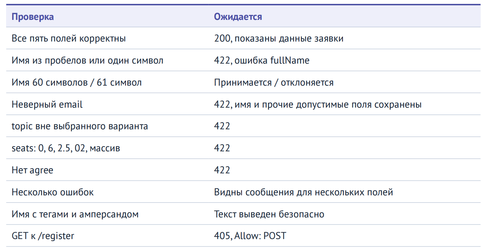

# Практическая 02 · starter

Среда: Windows, Uniform Server, PHP 8.3–8.5. Веб-корень — только `public`.
Полная настройка Apache/PHP/Composer находится в общем справочнике курса.

1. Скопируйте этот проект в отдельную папку, например `C:\WebLabs\pr02`.
2. Установите вариант A/B/C в `config.php`.
3. Настройте учебный VirtualHost на папку `public` этого проекта; URL `http://localhost:8088/`.
4. Проверьте `http://localhost:8088/health.php`.

## TODO текущей работы

- `P02-SCALAR` — `app.php`: Отличить строку от массива, проверить UTF-8 и убрать крайние пробелы.
- `P02-VALIDATE` — `app.php`: Проверить имя, email, тему, места и согласие; собрать ошибки по полям.
- `P02-ESCAPE` — `app.php`: Реализовать htmlspecialchars для HTML-текста и атрибута.

## Проверочные запросы



```powershell
PS C:\Users\almaz> curl.exe -i -d "email=student@example.test&topic=php&seats=2&agree=1" --data-urlencode "fullName=Anna Example" "http://localhost:8088/register"
HTTP/1.1 200 OK
Date: Wed, 07 Oct 2026 12:09:27 GMT
Server: Apache
Content-Length: 502
Content-Type: text/html; charset=UTF-8

<!doctype html><html lang="ru"><meta charset="utf-8"><title>Форма заявки</title><link rel="stylesheet" href="/style.css"><h1>Форма заявки</h1><h2>Предпросмотр подтверждён</h2><p>Имя: Anna Example</p><p>Email: student@example.test</p><p>Тема: PHP</p><p>Мест: 2</p><p>Заявка не сохранена; повторная отправка только повторяет проверку.</p><p><a href="/">Новая заявка</a></p></html>
```

Контролируемый ответ 501 с названием TODO означает незавершённое задание, а не ошибку установки.
В №3 сначала настройте автозагрузку; в №8 отказ CSRF до выполнения TODO ожидаем.
После выполнения передайте исходники, composer.json/lock (если есть) и короткий README.
Описания учебных TODO можно оставить в комментариях; исполняемые заглушки нужно заменить.
